# Gameng — System Architecture

> Visual reference of the full Gameng system: Engine, BFF, Sandbox, auth flows, and data model.

---

## 1. High-Level Overview

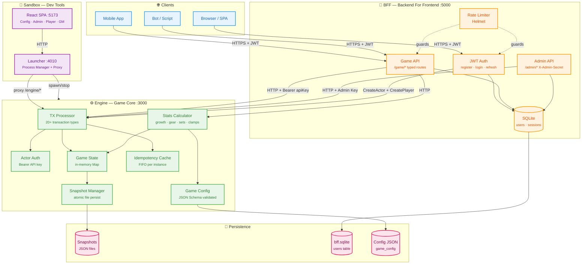

---

## 2. Network Topology & Ports

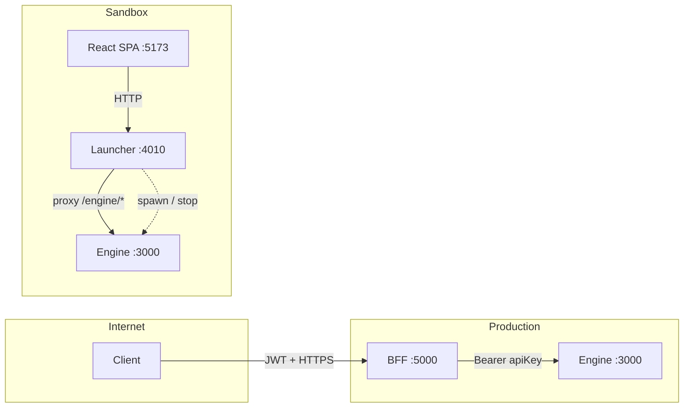

---

## 3. Authentication Chain

The system uses a **dual-auth model**: JWT for external clients (via BFF), Bearer API keys for engine-level identity.

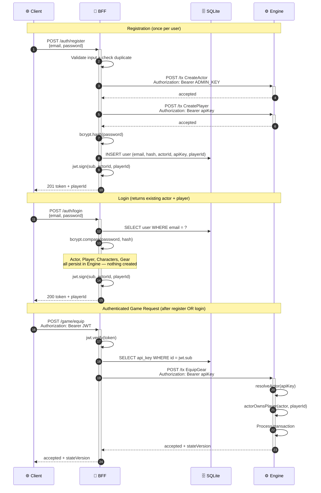

---

## 4. Identity & Ownership Model

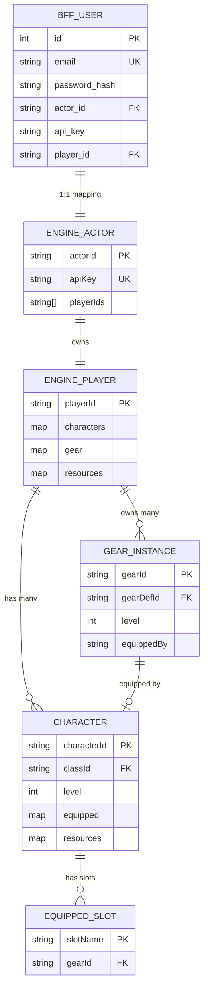

---

## 5. Transaction Processing Pipeline

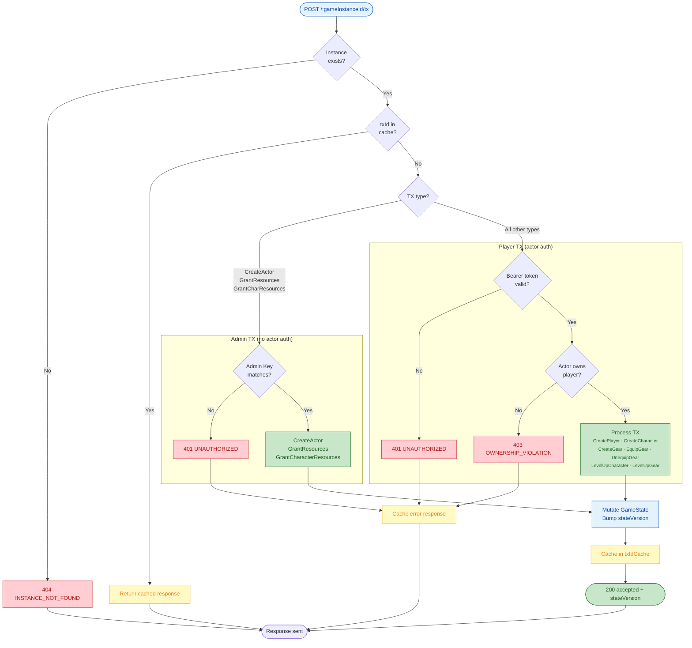

---

## 6. Stats Computation Pipeline

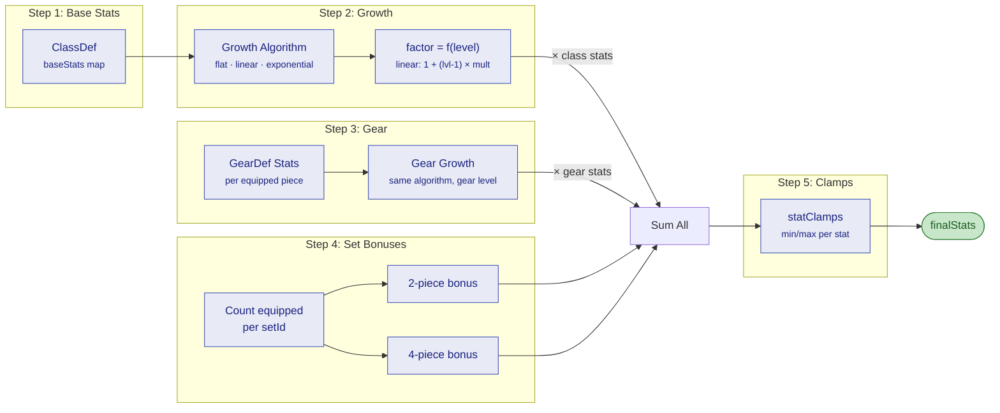

---

## 7. BFF Route Map

```mermaid
graph TB
  subgraph Public["🔓 Public (no auth)"]
    H["GET /health"]
    GH["GET /game/health"]
    GC["GET /game/config"]
    GV["GET /game/version"]
  end

  subgraph Auth["🔑 Auth Routes (rate-limited)"]
    REG["POST /auth/register<br/><small>5 req/min</small>"]
    LOG["POST /auth/login<br/><small>10 req/min</small>"]
    REF["POST /auth/refresh<br/><small>JWT required</small>"]
  end

  subgraph Game["🎮 Game Routes (JWT required)"]
    GP["GET /game/player"]
    GS["GET /game/stats/:charId"]
    CC["POST /game/character"]
    CG["POST /game/gear"]
    EQ["POST /game/equip"]
    UE["POST /game/unequip"]
    LC["POST /game/levelup/character"]
    LG["POST /game/levelup/gear"]
    TX["POST /game/tx<br/><small>raw passthrough</small>"]
  end

  subgraph Admin["🛡️ Admin Routes (X-Admin-Secret)"]
    GR["POST /admin/grant-resources"]
    GCR["POST /admin/grant-character-resources"]
    LU["GET /admin/users"]
  end

  subgraph Engine["⚙️ Engine"]
    ETXP["POST /:id/tx"]
    EGET["GET /:id/state/player/:pid"]
    ESTAT["GET /:id/character/:cid/stats"]
    ECONF["GET /:id/config"]
    EVER["GET /:id/stateVersion"]
    EHLT["GET /health"]
  end

  H -->|probe| EHLT
  GH --> EHLT
  GC --> ECONF
  GV --> EVER

  REG -->|"CreateActor + CreatePlayer"| ETXP
  GP -->|"inject apiKey"| EGET
  GS -->|"inject apiKey"| ESTAT
  CC -->|"auto-fill txId, playerId"| ETXP
  CG --> ETXP
  EQ --> ETXP
  UE --> ETXP
  LC --> ETXP
  LG --> ETXP
  TX --> ETXP

  GR -->|"admin key"| ETXP
  GCR -->|"admin key"| ETXP

  classDef pub fill:#e8f5e9,stroke:#4caf50,color:#1b5e20
  classDef auth fill:#fff3e0,stroke:#ff9800,color:#e65100
  classDef game fill:#e3f2fd,stroke:#2196f3,color:#0d47a1
  classDef admin fill:#fce4ec,stroke:#e91e63,color:#880e4f
  classDef eng fill:#f5f5f5,stroke:#616161,color:#212121

  class H,GH,GC,GV pub
  class REG,LOG,REF auth
  class GP,GS,CC,CG,EQ,UE,LC,LG,TX game
  class GR,GCR,LU admin
  class ETXP,EGET,ESTAT,ECONF,EVER,EHLT eng
```

---

## 8. Sandbox Architecture

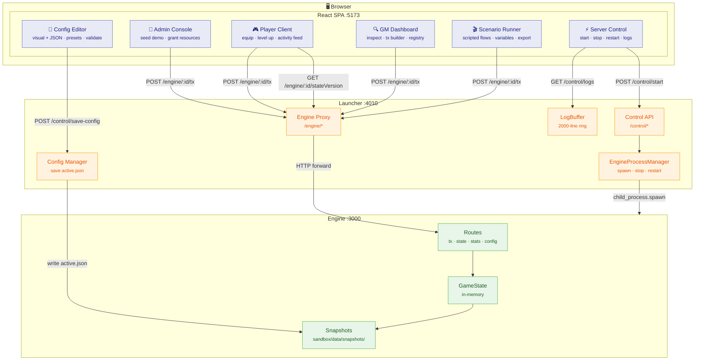

---

## 9. Snapshot Lifecycle

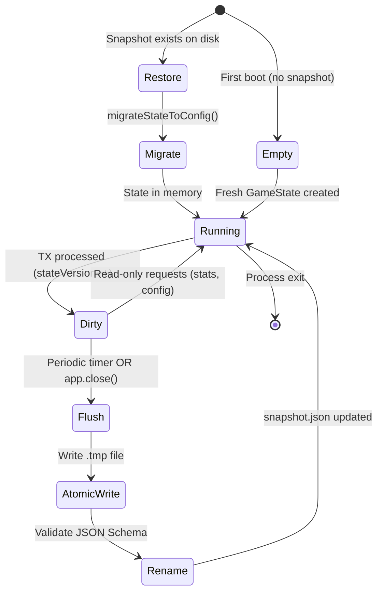

---

## 10. Scoped Resources & Cost Flow

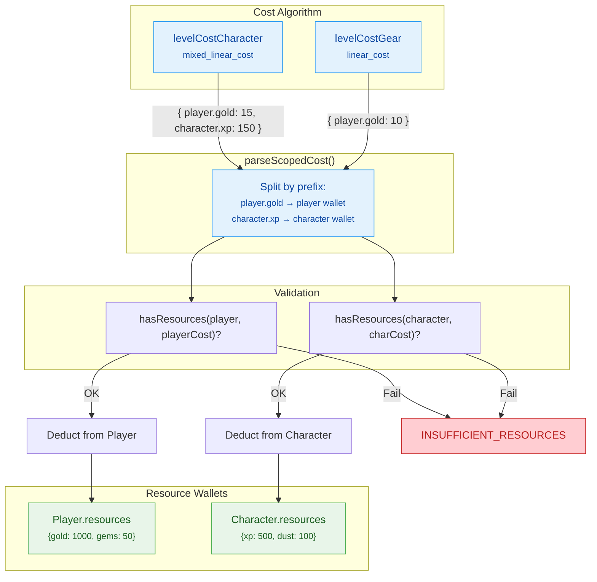

---

## 11. Environment Variables Summary

| Variable | Default | Component | Description |
|----------|---------|-----------|-------------|
| `PORT` | `3000` | Engine | HTTP listen port |
| `HOST` | `0.0.0.0` | Engine | Listen address |
| `ADMIN_API_KEY` | _(none)_ | Engine | Admin bearer token for CreateActor/Grant |
| `SNAPSHOT_DIR` | `snapshots/` | Engine | Persistence directory |
| `SNAPSHOT_INTERVAL_MS` | `10000` | Engine | Auto-flush interval (0 = disabled) |
| `GAMENG_E2E` | _(none)_ | Engine | Enables `POST /__shutdown` |
| `GAMENG_MAX_IDEMPOTENCY_ENTRIES` | `1000` | Engine | txId cache size |
| `BFF_PORT` | `5000` | BFF | HTTP listen port |
| `ENGINE_URL` | `http://localhost:3000` | BFF | Engine base URL |
| `GAME_INSTANCE_ID` | `instance_001` | BFF | Target engine instance |
| `BFF_JWT_SECRET` | _(required)_ | BFF | JWT signing key |
| `BFF_ADMIN_API_KEY` | _(required)_ | BFF | Engine admin key (for registration) |
| `BFF_INTERNAL_ADMIN_SECRET` | _(none)_ | BFF | X-Admin-Secret header value |
| `BFF_DB_PATH` | `bff/data/bff.sqlite` | BFF | SQLite database path |
| `BFF_BCRYPT_ROUNDS` | `12` | BFF | Password hashing cost |
| `BFF_RATE_LIMIT_MAX` | `100` | BFF | Max requests per window |
| `LAUNCHER_PORT` | `4010` | Sandbox | Launcher HTTP port |

---

## 12. Security Layers

```mermaid
graph LR
  subgraph External["External Boundary"]
    Helmet["🛡️ Helmet<br/><small>Security headers</small>"]
    Rate["⏱️ Rate Limit<br/><small>100 req/min global<br/>5/min register<br/>10/min login</small>"]
    CORS["🌐 CORS<br/><small>origin: configurable</small>"]
  end

  subgraph Auth_Layer["Authentication"]
    JWT_V["🔑 JWT Verify<br/><small>requireAuth preHandler</small>"]
    AdminS["🛡️ X-Admin-Secret<br/><small>header check</small>"]
    BcryptH["🔒 bcrypt<br/><small>12 rounds (prod)</small>"]
  end

  subgraph Engine_Auth["Engine Auth"]
    Bearer["🎫 Bearer API Key<br/><small>resolveActor()</small>"]
    Owner["👤 Ownership<br/><small>actorOwnsPlayer()</small>"]
    AdminK["🔑 ADMIN_API_KEY<br/><small>gated admin TXs</small>"]
  end

  subgraph Data_Safety["Data Safety"]
    Idemp["♻️ Idempotency<br/><small>duplicate TX prevention</small>"]
    Schema["📋 Schema Validation<br/><small>JSON Schema draft-07</small>"]
    Atomic["💾 Atomic Writes<br/><small>.tmp → rename</small>"]
  end

  External --> Auth_Layer --> Engine_Auth --> Data_Safety

  classDef ext fill:#e8eaf6,stroke:#5c6bc0
  classDef auth fill:#fff3e0,stroke:#ff9800
  classDef eng fill:#e8f5e9,stroke:#4caf50
  classDef data fill:#fce4ec,stroke:#e91e63

  class Helmet,Rate,CORS ext
  class JWT_V,AdminS,BcryptH auth
  class Bearer,Owner,AdminK eng
  class Idemp,Schema,Atomic data
```

---

## 13. Project Structure

```
gameng/
├── src/                          # Engine source
│   ├── app.ts                    # createApp() factory
│   ├── server.ts                 # Bootstrap + listen
│   ├── state.ts                  # Domain types (GameState, Player, Character...)
│   ├── auth.ts                   # Actor auth (resolveActor, actorOwnsPlayer)
│   ├── migrator.ts               # State migration on snapshot restore
│   ├── snapshot-manager.ts       # Atomic persist + restore
│   ├── idempotency-store.ts      # FIFO txId cache
│   ├── algorithms/
│   │   ├── growth.ts             # flat · linear · exponential
│   │   └── level-cost.ts         # flat · free · linear_cost · mixed_linear_cost
│   └── routes/
│       ├── health.ts             # GET /health
│       ├── tx.ts                 # POST /:id/tx (all transactions)
│       ├── player-state.ts       # GET /:id/state/player/:pid
│       ├── stats.ts              # GET /:id/character/:cid/stats
│       ├── state-version.ts      # GET /:id/stateVersion
│       └── config.ts             # GET /:id/config
│
├── bff/                          # Backend For Frontend
│   ├── src/
│   │   ├── server.ts             # Bootstrap (Fastify + JWT + DB + routes)
│   │   ├── config.ts             # Env var resolution → BffConfig
│   │   ├── proxy.ts              # proxyToEngine() HTTP forwarder
│   │   ├── db.ts                 # SQLite init + migrations
│   │   ├── user-store.ts         # User CRUD (prepared statements)
│   │   ├── types.ts              # Request body interfaces
│   │   ├── auth/
│   │   │   ├── jwt.ts            # registerJwt() + JwtPayload
│   │   │   ├── passwords.ts      # bcrypt hash/verify
│   │   │   └── middleware.ts     # requireAuth preHandler
│   │   └── routes/
│   │       ├── auth-routes.ts    # register · login · refresh
│   │       ├── game-routes.ts    # /game/* typed endpoints
│   │       ├── admin-routes.ts   # /admin/* X-Admin-Secret
│   │       └── health-routes.ts  # GET /health (engine probe + DB)
│   ├── migrations/
│   │   └── 001-initial.sql       # Users table DDL
│   └── tests/                    # 54 unit + 30 E2E tests
│
├── sandbox/                      # Development tools
│   └── apps/
│       ├── launcher/             # Engine process manager (:4010)
│       │   └── src/
│       │       ├── engine.ts     # EngineProcessManager
│       │       ├── routes.ts     # Control + proxy routes
│       │       └── log-buffer.ts # 2000-line ring buffer
│       └── web/                  # React SPA (:5173)
│           └── src/pages/
│               ├── ServerControl.tsx
│               ├── ConfigEditor.tsx
│               ├── AdminPanel.tsx
│               ├── PlayerView.tsx
│               ├── GameMaster.tsx
│               └── ScenarioRunner.tsx
│
├── schemas/                      # JSON Schema draft-07
├── openapi/                      # OpenAPI 3.1.0 spec
├── examples/                     # Golden config/state files
├── tests/                        # Engine tests (358 unit + 51 E2E)
└── docs/                         # Documentation
```
