# Gameng — System Architecture

> Visual reference of the full Gameng system: Engine, BFF, Sandbox, auth flows, and data model.

---

## 1. High-Level Overview

```mermaid
graph TB
  subgraph Clients["🌐 Clients"]
    direction LR
    Browser["Browser / SPA"]
    Mobile["Mobile App"]
    Bot["Bot / Script"]
  end

  subgraph BFF_Layer["🔐 BFF — Backend For Frontend  :5000"]
    direction TB
    JWT["JWT Auth<br/><small>register · login · refresh</small>"]
    GameAPI["Game API<br/><small>/game/* typed routes</small>"]
    AdminAPI["Admin API<br/><small>/admin/* X-Admin-Secret</small>"]
    SQLite[("SQLite<br/><small>users · sessions</small>")]
    RateLimit["Rate Limiter<br/>Helmet"]
  end

  subgraph Engine_Layer["⚙️ Engine — Game Core  :3000"]
    direction TB
    TxProcessor["TX Processor<br/><small>20+ transaction types</small>"]
    AuthEngine["Actor Auth<br/><small>Bearer API key</small>"]
    StatsCalc["Stats Calculator<br/><small>growth · gear · sets · clamps</small>"]
    StateStore["Game State<br/><small>in-memory Map</small>"]
    Snapshots["Snapshot Manager<br/><small>atomic file persist</small>"]
    Idempotency["Idempotency Cache<br/><small>FIFO per instance</small>"]
    Config["Game Config<br/><small>JSON Schema validated</small>"]
  end

  subgraph Sandbox["🧪 Sandbox — Dev Tools"]
    direction TB
    WebSPA["React SPA  :5173<br/><small>Config · Admin · Player · GM</small>"]
    Launcher["Launcher  :4010<br/><small>Process Manager + Proxy</small>"]
  end

  subgraph Storage["💾 Persistence"]
    SnapFiles[("Snapshots<br/><small>JSON files</small>")]
    BffDb[("bff.sqlite<br/><small>users table</small>")]
    ConfigFiles[("Config JSON<br/><small>game_config</small>")]
  end

  %% Client flows
  Browser -->|"HTTPS + JWT"| JWT
  Mobile -->|"HTTPS + JWT"| GameAPI
  Bot -->|"HTTPS + JWT"| GameAPI

  %% BFF internal
  JWT --> SQLite
  GameAPI --> SQLite
  AdminAPI --> SQLite
  RateLimit -.->|guards| JWT
  RateLimit -.->|guards| GameAPI

  %% BFF → Engine
  GameAPI -->|"HTTP + Bearer apiKey"| TxProcessor
  GameAPI -->|"HTTP"| StatsCalc
  AdminAPI -->|"HTTP + Admin Key"| TxProcessor
  JWT -->|"CreateActor + CreatePlayer"| TxProcessor

  %% Engine internal
  TxProcessor --> AuthEngine
  TxProcessor --> StateStore
  TxProcessor --> Idempotency
  StatsCalc --> StateStore
  StatsCalc --> Config
  StateStore --> Snapshots

  %% Sandbox flow
  WebSPA -->|"HTTP"| Launcher
  Launcher -->|"proxy /engine/*"| TxProcessor
  Launcher -->|"spawn/stop"| Engine_Layer

  %% Storage
  Snapshots --> SnapFiles
  SQLite --> BffDb
  Config --> ConfigFiles

  %% Styling
  classDef client fill:#e8f4fd,stroke:#2196f3,stroke-width:2px,color:#1565c0
  classDef bff fill:#fff3e0,stroke:#ff9800,stroke-width:2px,color:#e65100
  classDef engine fill:#e8f5e9,stroke:#4caf50,stroke-width:2px,color:#2e7d32
  classDef sandbox fill:#f3e5f5,stroke:#9c27b0,stroke-width:2px,color:#6a1b9a
  classDef storage fill:#fce4ec,stroke:#e91e63,stroke-width:2px,color:#880e4f

  class Browser,Mobile,Bot client
  class JWT,GameAPI,AdminAPI,SQLite,RateLimit bff
  class TxProcessor,AuthEngine,StatsCalc,StateStore,Snapshots,Idempotency,Config engine
  class WebSPA,Launcher sandbox
  class SnapFiles,BffDb,ConfigFiles storage
```



---

## 2. Network Topology & Ports


---

## 3. Authentication Chain

The system uses a **dual-auth model**: JWT for external clients (via BFF), Bearer API keys for engine-level identity.


---

## 4. Identity & Ownership Model


---

## 5. Transaction Processing Pipeline


---

## 6. Stats Computation Pipeline

```mermaid
flowchart LR
  subgraph Step1["Step 1: Base Stats"]
    ClassDef["ClassDef<br/><small>baseStats map</small>"]
  end

  subgraph Step2["Step 2: Growth"]
    Growth["Growth Algorithm<br/><small>flat · linear · exponential</small>"]
    Factor["factor = f(level)<br/><small>linear: 1 + (lvl-1) × mult</small>"]
  end

  subgraph Step3["Step 3: Gear"]
    GearStats["GearDef Stats<br/><small>per equipped piece</small>"]
    GearGrowth["Gear Growth<br/><small>same algorithm, gear level</small>"]
  end

  subgraph Step4["Step 4: Set Bonuses"]
    SetCheck["Count equipped<br/>per setId"]
    Bonus2["2-piece bonus"]
    Bonus4["4-piece bonus"]
  end

  subgraph Step5["Step 5: Clamps"]
    Clamp["statClamps<br/><small>min/max per stat</small>"]
  end

  ClassDef --> Growth --> Factor
  Factor -->|"× class stats"| Sum["Sum All"]
  GearStats --> GearGrowth -->|"× gear stats"| Sum
  SetCheck --> Bonus2 --> Sum
  SetCheck --> Bonus4 --> Sum
  Sum --> Clamp --> Final(["finalStats"])

  classDef step fill:#e8eaf6,stroke:#3f51b5,color:#1a237e
  classDef result fill:#c8e6c9,stroke:#2e7d32,color:#1b5e20

  class ClassDef,Growth,Factor step
  class GearStats,GearGrowth step
  class SetCheck,Bonus2,Bonus4 step
  class Clamp step
  class Final result
```



---

## 7. BFF Route Map


---

## 8. Sandbox Architecture

```mermaid
graph TB
  subgraph Browser["🖥️ Browser"]
    subgraph Pages["React SPA  :5173"]
      P1["⚡ Server Control<br/><small>start · stop · restart · logs</small>"]
      P2["📝 Config Editor<br/><small>visual + JSON · presets · validate</small>"]
      P3["👑 Admin Console<br/><small>seed demo · grant resources</small>"]
      P4["🎮 Player Client<br/><small>equip · level up · activity feed</small>"]
      P5["🔍 GM Dashboard<br/><small>inspect · tx builder · registry</small>"]
      P6["🎬 Scenario Runner<br/><small>scripted flows · variables · export</small>"]
    end
  end

  subgraph Launcher_Process["Launcher  :4010"]
    Control["Control API<br/><small>/control/*</small>"]
    Proxy["Engine Proxy<br/><small>/engine/*</small>"]
    ConfigMgr["Config Manager<br/><small>save active.json</small>"]
    EPM["EngineProcessManager<br/><small>spawn · stop · restart</small>"]
    LogBuf["LogBuffer<br/><small>2000-line ring</small>"]
  end

  subgraph Engine_Process["Engine  :3000"]
    EngRoutes["Routes<br/><small>tx · state · stats · config</small>"]
    EngState["GameState<br/><small>in-memory</small>"]
    EngSnap["Snapshots<br/><small>sandbox/data/snapshots/</small>"]
  end

  P1 -->|"POST /control/start"| Control
  P1 -->|"GET /control/logs"| LogBuf
  P2 -->|"POST /control/save-config"| ConfigMgr
  P3 -->|"POST /engine/:id/tx"| Proxy
  P4 -->|"POST /engine/:id/tx"| Proxy
  P4 -->|"GET /engine/:id/stateVersion"| Proxy
  P5 -->|"POST /engine/:id/tx"| Proxy
  P6 -->|"POST /engine/:id/tx"| Proxy

  Control --> EPM
  EPM -->|"child_process.spawn"| Engine_Process
  Proxy -->|"HTTP forward"| EngRoutes
  ConfigMgr -->|"write active.json"| EngSnap

  EngRoutes --> EngState
  EngState --> EngSnap

  classDef page fill:#e8eaf6,stroke:#5c6bc0,color:#1a237e
  classDef launcher fill:#fff3e0,stroke:#ff9800,color:#e65100
  classDef engine fill:#e8f5e9,stroke:#4caf50,color:#1b5e20

  class P1,P2,P3,P4,P5,P6 page
  class Control,Proxy,ConfigMgr,EPM,LogBuf launcher
  class EngRoutes,EngState,EngSnap engine
```



---

## 9. Snapshot Lifecycle


---

## 10. Scoped Resources & Cost Flow


---

## 11. Environment Variables Summary

| Variable | Default | Component | Description |
|----------|---------|-----------|-------------|
| `PORT` | `3000` | Engine | HTTP listen port |
| `HOST` | `0.0.0.0` | Engine | Listen address |
| `ADMIN_API_KEY` | _(none)_ | Engine | Admin bearer token for CreateActor/Grant |
| `SNAPSHOT_DIR` | `snapshots/` | Engine | Persistence directory |
| `SNAPSHOT_INTERVAL_MS` | `10000` | Engine | Auto-flush interval (0 = disabled) |
| `GAMENG_E2E` | _(none)_ | Engine | Enables `POST /__shutdown` |
| `GAMENG_MAX_IDEMPOTENCY_ENTRIES` | `1000` | Engine | txId cache size |
| `BFF_PORT` | `5000` | BFF | HTTP listen port |
| `ENGINE_URL` | `http://localhost:3000` | BFF | Engine base URL |
| `GAME_INSTANCE_ID` | `instance_001` | BFF | Target engine instance |
| `BFF_JWT_SECRET` | _(required)_ | BFF | JWT signing key |
| `BFF_ADMIN_API_KEY` | _(required)_ | BFF | Engine admin key (for registration) |
| `BFF_INTERNAL_ADMIN_SECRET` | _(none)_ | BFF | X-Admin-Secret header value |
| `BFF_DB_PATH` | `bff/data/bff.sqlite` | BFF | SQLite database path |
| `BFF_BCRYPT_ROUNDS` | `12` | BFF | Password hashing cost |
| `BFF_RATE_LIMIT_MAX` | `100` | BFF | Max requests per window |
| `LAUNCHER_PORT` | `4010` | Sandbox | Launcher HTTP port |

---

## 12. Security Layers

```mermaid
graph LR
  subgraph External["External Boundary"]
    Helmet["🛡️ Helmet<br/><small>Security headers</small>"]
    Rate["⏱️ Rate Limit<br/><small>100 req/min global<br/>5/min register<br/>10/min login</small>"]
    CORS["🌐 CORS<br/><small>origin: configurable</small>"]
  end

  subgraph Auth_Layer["Authentication"]
    JWT_V["🔑 JWT Verify<br/><small>requireAuth preHandler</small>"]
    AdminS["🛡️ X-Admin-Secret<br/><small>header check</small>"]
    BcryptH["🔒 bcrypt<br/><small>12 rounds (prod)</small>"]
  end

  subgraph Engine_Auth["Engine Auth"]
    Bearer["🎫 Bearer API Key<br/><small>resolveActor()</small>"]
    Owner["👤 Ownership<br/><small>actorOwnsPlayer()</small>"]
    AdminK["🔑 ADMIN_API_KEY<br/><small>gated admin TXs</small>"]
  end

  subgraph Data_Safety["Data Safety"]
    Idemp["♻️ Idempotency<br/><small>duplicate TX prevention</small>"]
    Schema["📋 Schema Validation<br/><small>JSON Schema draft-07</small>"]
    Atomic["💾 Atomic Writes<br/><small>.tmp → rename</small>"]
  end

  External --> Auth_Layer --> Engine_Auth --> Data_Safety

  classDef ext fill:#e8eaf6,stroke:#5c6bc0
  classDef auth fill:#fff3e0,stroke:#ff9800
  classDef eng fill:#e8f5e9,stroke:#4caf50
  classDef data fill:#fce4ec,stroke:#e91e63

  class Helmet,Rate,CORS ext
  class JWT_V,AdminS,BcryptH auth
  class Bearer,Owner,AdminK eng
  class Idemp,Schema,Atomic data
```



---

## 13. Project Structure

```
gameng/
├── src/                          # Engine source
│   ├── app.ts                    # createApp() factory
│   ├── server.ts                 # Bootstrap + listen
│   ├── state.ts                  # Domain types (GameState, Player, Character...)
│   ├── auth.ts                   # Actor auth (resolveActor, actorOwnsPlayer)
│   ├── migrator.ts               # State migration on snapshot restore
│   ├── snapshot-manager.ts       # Atomic persist + restore
│   ├── idempotency-store.ts      # FIFO txId cache
│   ├── algorithms/
│   │   ├── growth.ts             # flat · linear · exponential
│   │   └── level-cost.ts         # flat · free · linear_cost · mixed_linear_cost
│   └── routes/
│       ├── health.ts             # GET /health
│       ├── tx.ts                 # POST /:id/tx (all transactions)
│       ├── player-state.ts       # GET /:id/state/player/:pid
│       ├── stats.ts              # GET /:id/character/:cid/stats
│       ├── state-version.ts      # GET /:id/stateVersion
│       └── config.ts             # GET /:id/config
│
├── bff/                          # Backend For Frontend
│   ├── src/
│   │   ├── server.ts             # Bootstrap (Fastify + JWT + DB + routes)
│   │   ├── config.ts             # Env var resolution → BffConfig
│   │   ├── proxy.ts              # proxyToEngine() HTTP forwarder
│   │   ├── db.ts                 # SQLite init + migrations
│   │   ├── user-store.ts         # User CRUD (prepared statements)
│   │   ├── types.ts              # Request body interfaces
│   │   ├── auth/
│   │   │   ├── jwt.ts            # registerJwt() + JwtPayload
│   │   │   ├── passwords.ts      # bcrypt hash/verify
│   │   │   └── middleware.ts     # requireAuth preHandler
│   │   └── routes/
│   │       ├── auth-routes.ts    # register · login · refresh
│   │       ├── game-routes.ts    # /game/* typed endpoints
│   │       ├── admin-routes.ts   # /admin/* X-Admin-Secret
│   │       └── health-routes.ts  # GET /health (engine probe + DB)
│   ├── migrations/
│   │   └── 001-initial.sql       # Users table DDL
│   └── tests/                    # 54 unit + 30 E2E tests
│
├── sandbox/                      # Development tools
│   └── apps/
│       ├── launcher/             # Engine process manager (:4010)
│       │   └── src/
│       │       ├── engine.ts     # EngineProcessManager
│       │       ├── routes.ts     # Control + proxy routes
│       │       └── log-buffer.ts # 2000-line ring buffer
│       └── web/                  # React SPA (:5173)
│           └── src/pages/
│               ├── ServerControl.tsx
│               ├── ConfigEditor.tsx
│               ├── AdminPanel.tsx
│               ├── PlayerView.tsx
│               ├── GameMaster.tsx
│               └── ScenarioRunner.tsx
│
├── schemas/                      # JSON Schema draft-07
├── openapi/                      # OpenAPI 3.1.0 spec
├── examples/                     # Golden config/state files
├── tests/                        # Engine tests (358 unit + 51 E2E)
└── docs/                         # Documentation
```
