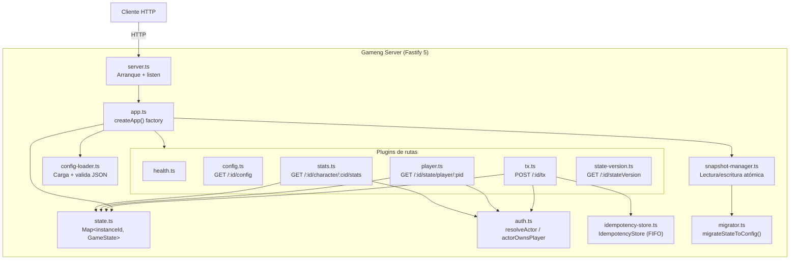

# Guía de Implementación — Gameng Engine

> **Versión**: Corresponde al código en el repositorio a fecha de la última actualización de este documento.
> **Audiencia**: Desarrollador técnico que se incorpora al proyecto.
> **Convención**: Todo lo descrito aquí procede del código fuente (`src/`, `schemas/`, `openapi/`, `tests/`). Lo que aparece en specs pero **no** está implementado se marca explícitamente como _"No implementado"_.

---

## Índice

- [A. Visión general](#a-visión-general)
- [B. Arquitectura](#b-arquitectura)
- [C. Modelo de datos](#c-modelo-de-datos)
- [D. API HTTP](#d-api-http)
- [E. Transacciones soportadas](#e-transacciones-soportadas)
- [F. Cálculo de stats](#f-cálculo-de-stats)
- [G. Persistencia](#g-persistencia)
- [H. Migración best-effort](#h-migración-best-effort)
- [I. Configuración y despliegue](#i-configuración-y-despliegue)
- [J. Testing](#j-testing)
- [K. Depurar y diagnosticar](#k-depurar-y-diagnosticar)
- [L. Roadmap — Gaps respecto a specs](#l-roadmap--gaps-respecto-a-specs)

---

## A. Visión general

Gameng es un **motor RPG server-side data-driven** enfocado en:

- Gestión de personajes, equipamiento y stats.
- Configuración declarativa vía JSON (clases, gearDefs, sets, restricciones, slots).
- Transacciones atómicas con resultado determinista (`accepted: true/false`).
- Persistencia en disco vía snapshots + migración best-effort al cambiar de config.
- Autorización por Bearer token con modelo de actores y ownership.

**Qué hace hoy:**

| Capacidad | Estado |
|---|---|
| CRUD de actores, jugadores, personajes, gear | Implementado |
| Equipar / desequipar gear (1 y multi-slot) | Implementado |
| Level up de personajes y gear (con coste de recursos) | Implementado |
| Restricciones de equipamiento (clase, nivel) | Implementado |
| Set bonuses por umbral de piezas | Implementado |
| Cálculo de stats (base + gear + sets + growth) | Implementado |
| Snapshots a disco + restore al arrancar | Implementado |
| Migración best-effort al cambiar config | Implementado |
| Auth por Bearer token (actor → player ownership) | Implementado |
| ADMIN_API_KEY obligatorio para CreateActor y GrantResources | Implementado |
| Idempotencia por txId (cache FIFO por instancia) | Implementado |
| Gear swap (equip sobre slot ocupado, modo no-strict) | Implementado |

**Qué NO hace (aún):**

| Capacidad | Estado |
|---|---|
| Transaction log / replay | Fuera de alcance (no requerido) |
| Hot-reload de config | No implementado (requiere restart) |
| Combate, economía, inventario complejo | Fuera de scope actual |

---

## B. Arquitectura

### Diagrama de componentes



### Módulos y responsabilidades

#### `src/server.ts` — Punto de entrada

- Llama a `createApp()`, lee `PORT` y `HOST` del entorno.
- En modo E2E (`GAMENG_E2E=1`), registra `POST /__shutdown` para graceful shutdown en Windows.
- Registra handler `SIGTERM` para Linux/macOS.

#### `src/app.ts` — Factory `createApp()`

Acepta `string | AppOptions`:

```typescript
interface AppOptions {
  configPath?: string;
  snapshotDir?: string;
  snapshotIntervalMs?: number;
  adminApiKey?: string;
  maxIdempotencyEntries?: number;
}
```

Responsabilidades:
1. Carga la config vía `loadGameConfig()`.
2. Crea el store en memoria (`Map<string, GameState>`).
3. Si `snapshotDir` está definido, restaura snapshots con migración.
4. Decora Fastify: `gameInstances`, `gameConfigs`, `activeConfig`, `adminApiKey`, `txIdCacheMaxEntries`, `flushSnapshots()`.
5. Registra plugins de rutas.
6. Configura flush periódico (si `snapshotIntervalMs > 0`) y flush on close.

#### `src/config-loader.ts` — Carga de GameConfig

- Lee JSON de disco (`configPath` | `CONFIG_PATH` env | `examples/config_minimal.json`).
- Valida contra `schemas/game_config.schema.json` (Ajv 8).
- Lanza excepción si la validación falla (el servidor no arranca).

#### `src/state.ts` — Tipos del dominio + store

Define todas las interfaces TypeScript del modelo: `GameState`, `Player`, `Character`, `GearInstance`, `Actor`, `GameConfig`, `ClassDef`, `GearDef`, `SetDef`, etc.

`createGameInstanceStore(gameConfigId)` devuelve un `Map<string, GameState>` con una instancia `instance_001` vacía por defecto.

Extiende `FastifyInstance` con las decoraciones del motor.

#### `src/auth.ts` — Autorización

Dos funciones puras:

| Función | Firma | Descripción |
|---|---|---|
| `resolveActor` | `(authHeader, state) → { actorId, actor } \| null` | Parsea `Bearer <token>`, busca actor por apiKey en `state.actors`. |
| `actorOwnsPlayer` | `(actor, playerId) → boolean` | Comprueba `actor.playerIds.includes(playerId)`. |

No hay hook global de Fastify — cada handler llama explícitamente a estas funciones según las reglas de su endpoint.

#### `src/snapshot-manager.ts` — Persistencia

Clase `SnapshotManager`:
- **Constructor**: recibe directorio, lo crea si no existe, compila el schema de game_state para validación.
- **`saveOne(state)`**: Escritura atómica (`.tmp` → delete target → rename). Valida contra schema antes de escribir.
- **`saveAll(store)`**: Itera todo el store y persiste cada instancia.
- **`loadAll()`**: Lee todos los `.json` del directorio, valida, devuelve array de `GameState[]`. Ignora `.tmp` y ficheros inválidos.

#### `src/migrator.ts` — Migración best-effort

Función `migrateStateToConfig(state, config)` — ver [sección H](#h-migración-best-effort).

#### `src/routes/` — Plugins de rutas

| Archivo | Ruta | Método | Auth |
|---|---|---|---|
| `health.ts` | `/health` | GET | No |
| `config.ts` | `/:gameInstanceId/config` | GET | No |
| `state-version.ts` | `/:gameInstanceId/stateVersion` | GET | No |
| `tx.ts` | `/:gameInstanceId/tx` | POST | Depende del tipo de TX |
| `player.ts` | `/:gameInstanceId/state/player/:playerId` | GET | Sí (401 + 403) |
| `stats.ts` | `/:gameInstanceId/character/:characterId/stats` | GET | Sí (401 + 403) |

> **Una config por proceso:** El servidor carga exactamente una `GameConfig` al arrancar (`app.activeConfig`). `GET /:id/config` devuelve siempre esta config activa. `state.gameConfigId` se mantiene por compatibilidad con snapshots y lo normaliza el migrator al restaurar.

---

## C. Modelo de datos

### GameConfig (`schemas/game_config.schema.json`)

La configuración define las reglas del juego. Se carga al arrancar y es **inmutable en runtime**.

| Campo | Tipo | Descripción |
|---|---|---|
| `gameConfigId` | `string` | Identificador único de esta versión de config. |
| `maxLevel` | `integer ≥ 1` | Nivel máximo para personajes y gear. |
| `stats` | `string[]` | Catálogo de stat IDs (ej: `["strength", "hp"]`). |
| `slots` | `string[]` | Catálogo de slot IDs (ej: `["right_hand", "off_hand", "head"]`). |
| `classes` | `Record<classId, ClassDef>` | Clases con `baseStats`. |
| `gearDefs` | `Record<gearDefId, GearDef>` | Definiciones de gear: `baseStats`, `equipPatterns`, `restrictions`, `setId`, `setPieceCount`. |
| `sets` | `Record<setId, SetDef>` | Sets con array de `bonuses: [{ pieces, bonusStats }]`. |
| `algorithms` | `object` | Algoritmos de growth (flat, linear, exponential implementados) y cost (solo `flat` stub). |
| `statClamps` | `Record<statId, { min?, max? }>` | Clamp min/max post-cálculo. Opcional. |

**Archivos de ejemplo**: `examples/config_minimal.json`, `examples/config_sets.json`, `examples/config_costs.json`.

### GameState (`schemas/game_state.schema.json`)

Estado mutable de una instancia de juego. Uno por `gameInstanceId`.

| Campo | Tipo | Descripción |
|---|---|---|
| `gameInstanceId` | `string` | Identificador de la instancia. |
| `gameConfigId` | `string` | Config asociada. |
| `stateVersion` | `integer ≥ 0` | Contador monotónico, se incrementa en cada TX aceptada. |
| `players` | `Record<playerId, Player>` | Jugadores. |
| `actors` | `Record<actorId, Actor>` | Actores (auth). Opcional en schema (backward-compat). |
| `txIdCache` | `TxIdCacheEntry[]` | Cache acotado FIFO de resultados de TX para idempotencia (anti-duplicados). Opcional en schema (backward-compat). |

**Player:**

```
Player {
  characters: Record<characterId, Character>
  gear: Record<gearId, GearInstance>
  resources?: Record<resourceId, number>  // wallet, default {}
}
```

**Character:**

```
Character {
  classId: string        // referencia a config.classes
  level: integer ≥ 1
  equipped: Record<slotId, gearId>
}
```

**GearInstance:**

```
GearInstance {
  gearDefId: string      // referencia a config.gearDefs
  level: integer ≥ 1
  equippedBy?: string    // characterId o null
}
```

**Actor:**

```
Actor {
  apiKey: string         // Bearer token
  playerIds: string[]    // ownership
}
```

**Archivo de ejemplo**: `examples/state_empty.json`.

### Relaciones e invariantes


**Invariantes bidireccionales (enforced por migrator y runtime):**

1. Si `character.equipped[slotId] = gearId`, entonces `gear[gearId].equippedBy = characterId`.
2. Si `gear[gearId].equippedBy = characterId`, entonces existe `character.equipped[slotId] = gearId` para al menos un slot.
3. Un gear solo puede estar `equippedBy` un único character a la vez.
4. Multi-slot: el mismo `gearId` puede aparecer en múltiples slots (un entry por slot), pero se cuenta una sola vez para stats y sets.

---

## D. API HTTP

Especificación completa en `openapi/openapi.yaml`. Resumen:

### `GET /health`

Sin autenticación. Devuelve estado del servidor.

```json
{ "status": "ok", "timestamp": "2025-01-01T00:00:00.000Z", "uptime": 42.5 }
```

### `GET /:gameInstanceId/config`

**Sin auth**. Devuelve la config activa del proceso (siempre la misma para cualquier instancia válida).

**Response (200)**: Objeto `GameConfig` completo.

**Errores**: 404 (`INSTANCE_NOT_FOUND`).

### `POST /:gameInstanceId/tx`

Punto central de mutación. Acepta un JSON de transacción, devuelve resultado. **Idempotente por txId:** si se recibe un txId ya procesado, se devuelve el resultado cacheado (mismo statusCode y body) sin re-ejecutar mutaciones ni incrementar `stateVersion`. Se cachean todas las respuestas (200, 401, 500…) excepto las que ocurren antes del checkpoint de idempotencia (404 `INSTANCE_NOT_FOUND`, 400 `INSTANCE_MISMATCH`).

**Headers**: `Authorization: Bearer <token>` (siempre requerido; `CreateActor` y `GrantResources` usan `ADMIN_API_KEY`).

**Request body** (según `schemas/transaction.schema.json`):

```json
{
  "txId": "string (requerido, único)",
  "type": "CreateActor | CreatePlayer | CreateCharacter | ...",
  "gameInstanceId": "string (debe coincidir con path)",
  "playerId": "string (requerido excepto CreateActor)",
  "...campos adicionales según type..."
}
```

**Response — Aceptada (HTTP 200):**

```json
{ "txId": "tx_001", "accepted": true, "stateVersion": 5 }
```

**Response — Rechazada (HTTP 200):**

```json
{
  "txId": "tx_001",
  "accepted": false,
  "stateVersion": 4,
  "errorCode": "ALREADY_EXISTS",
  "errorMessage": "Player 'p1' already exists."
}
```

**Errores HTTP (no-200):**

| HTTP | errorCode | Causa |
|---|---|---|
| 401 | `UNAUTHORIZED` | Bearer token faltante/inválido, o ADMIN_API_KEY incorrecta para CreateActor |
| 404 | `INSTANCE_NOT_FOUND` | `gameInstanceId` no existe |
| 400 | `INSTANCE_MISMATCH` | Body `gameInstanceId` ≠ path param |
| 500 | `CONFIG_NOT_FOUND` | Config no cargada (error del servidor) |

### `GET /:gameInstanceId/state/player/:playerId`

**Auth**: Bearer token requerido. El actor debe ser owner del player.

**Response (200)**: Objeto `Player` completo (characters + gear).

**Errores**: 401 (`UNAUTHORIZED`), 403 (`OWNERSHIP_VIOLATION`), 404 (`INSTANCE_NOT_FOUND`, `PLAYER_NOT_FOUND`).

### `GET /:gameInstanceId/character/:characterId/stats`

**Auth**: Bearer token requerido. El actor debe ser owner del player que contiene el character.

**Response (200):**

```json
{
  "characterId": "char_1",
  "classId": "warrior",
  "level": 5,
  "finalStats": { "strength": 14, "hp": 38 }
}
```

**Errores**: 401, 403, 404 (`INSTANCE_NOT_FOUND`, `CHARACTER_NOT_FOUND`), 500.

### `GET /:gameInstanceId/stateVersion`

**Sin auth**. Lightweight polling endpoint — no requiere Bearer token.

**Response (200):**

```json
{
  "gameInstanceId": "instance_001",
  "stateVersion": 42
}
```

**Errores**: 404 (`INSTANCE_NOT_FOUND`).

### Uso de OpenAPI para clientes

El archivo `openapi/openapi.yaml` contiene la especificación completa OpenAPI 3.1.0. Se puede usar para:

- Generar clientes tipados (OpenAPI Generator, orval, etc.)
- Documentación interactiva (Redoc, Swagger UI)
- Validación: `npm run validate:openapi` (Redocly CLI)

---

## E. Transacciones soportadas

Implementadas en `src/routes/tx.ts`. Todas siguen el patrón: validar → mutar → `stateVersion++`.

### Tabla resumen

| Tipo | Campos requeridos | Auth | Descripción |
|---|---|---|---|
| `CreateActor` | `actorId`, `apiKey` | ADMIN_API_KEY | Crea un actor en el sistema de auth. |
| `CreatePlayer` | `playerId` | Bearer (actor) | Crea un player vacío. Auto-asocia al actor. |
| `CreateCharacter` | `playerId`, `characterId`, `classId` | Bearer + ownership | Crea un character nivel 1. |
| `CreateGear` | `playerId`, `gearId`, `gearDefId` | Bearer + ownership | Crea una instancia de gear nivel 1. |
| `LevelUpCharacter` | `playerId`, `characterId`, `levels?` | Bearer + ownership | Sube `levels` niveles (default 1). Valida coste de recursos. |
| `LevelUpGear` | `playerId`, `gearId`, `levels?` | Bearer + ownership | Sube `levels` niveles al gear. Valida coste de recursos. |
| `EquipGear` | `playerId`, `characterId`, `gearId`, `slotPattern?`, `swap?` | Bearer + ownership | Equipa gear en character. Multi-slot. `swap: true` auto-desequipa gear conflictivo. |
| `UnequipGear` | `playerId`, `gearId`, `characterId?` | Bearer + ownership | Desequipa gear del character. |
| `GrantResources` | `playerId`, `resources` | ADMIN_API_KEY | Suma recursos al wallet del player. |

### Orden de validación (EquipGear)

El caso más complejo. Orden determinista — se devuelve el primer error encontrado:

1. `PLAYER_NOT_FOUND`
2. `CONFIG_NOT_FOUND` (500)
3. `CHARACTER_NOT_FOUND`
4. `GEAR_NOT_FOUND`
5. `GEAR_ALREADY_EQUIPPED`
6. `INVALID_CONFIG_REFERENCE` (gearDefId no en config)
7. `RESTRICTION_FAILED` (allowedClasses → blockedClasses → requiredCharacterLevel → maxLevelDelta)
8. Resolver slot pattern (auto o explícito)
9. `INVALID_SLOT` (cada slot existe en config)
10. `SLOT_INCOMPATIBLE` (pattern coincide con un equipPattern del gearDef)
11. `SLOT_OCCUPIED` (modo strict: todos los slots deben estar libres) o swap automático (modo `swap: true`: desequipa gear previo de slots conflictivos)

### Catálogo de error codes

Ver [`docs/ERROR_CODES.md`](ERROR_CODES.md) para el catálogo completo con triggers y contextos.

---

## F. Cálculo de stats

Implementado en `src/routes/stats.ts`.

### Fórmula actual

```
finalStats[statId] = applyGrowth(classBase, charLevel) + applyGrowth(gearBase, gearLevel) + setBonusStats
```

Para cada `statId` del catálogo `config.stats`:

### Paso 1 — Stats base del personaje

```typescript
classBase[statId] = classDef?.baseStats[statId] ?? 0;
```

- Si la clase del personaje existe en config → usa `baseStats`.
- Si la clase es huérfana (migración) → todas las bases son `0`.

### Paso 2 — Crecimiento por nivel (class)

```typescript
classScaled = applyGrowth(classBase, character.level, config.algorithms.growth);
```

Implementado en `src/algorithms/growth.ts`. Tres algoritmos disponibles:

| Algoritmo | Fórmula | Params |
|---|---|---|
| `flat` | `floor(base)` | _(ninguno)_ |
| `linear` | `floor(base * (1 + perLevelMultiplier * (level-1)) + additivePerLevel[stat] * (level-1))` | `perLevelMultiplier`, `additivePerLevel?` |
| `exponential` | `floor(base * exponent^(level-1))` | `exponent` |

Todas devuelven exactamente `baseStats` en level 1 (identidad). `Math.floor` se aplica por componente.

Si `algorithmId` es desconocido o los params son inválidos → HTTP 500 `INVALID_CONFIG_REFERENCE`.

### Paso 3 — Stats de gear equipado (con growth)

```typescript
// Deduplicación por gearId (multi-slot cuenta una sola vez)
const seenGearIds = new Set<string>();
for (const gearId of Object.values(character.equipped)) {
  if (seenGearIds.has(gearId)) continue;
  seenGearIds.add(gearId);
  gearScaled = applyGrowth(gearDef.baseStats, gearInst.level, config.algorithms.growth);
  finalStats[statId] += gearScaled[statId] ?? 0;
}
```

- Se itera sobre los slots equipados del character.
- Gear multi-slot (ej: greatsword en `right_hand` + `off_hand`) aparece en múltiples slots pero se suma **una sola vez**.
- El mismo algoritmo de growth se aplica al gear usando `gearInst.level`.

### Paso 4 — Set bonuses

```typescript
// Conteo de piezas por set
setPieceCounts[setId] += gearDef.setPieceCount ?? 1;

// Activación por umbral
for (const bonus of setDef.bonuses) {
  if (pieceCount >= bonus.pieces) {
    finalStats[statId] += bonus.bonusStats[statId] ?? 0;
  }
}
```

- `setPieceCount` por defecto es 1. Un gear multi-slot puede valer 2 piezas (`setPieceCount: 2`).
- Múltiples umbrales pueden estar activos simultáneamente (ej: 2-piece y 4-piece).
- Si `setId` referenciado no existe en `config.sets` → se ignora silenciosamente.

### Paso 5 — Stat clamps

```typescript
if (config.statClamps) {
  for (const statId of config.stats) {
    const clamp = config.statClamps[statId];
    if (!clamp) continue;
    if (clamp.min != null && finalStats[statId] < clamp.min) finalStats[statId] = clamp.min;
    if (clamp.max != null && finalStats[statId] > clamp.max) finalStats[statId] = clamp.max;
  }
}
```

- Si `statClamps` es absent o vacío, no se aplica ningún clamp.
- Solo se clampean stats listados en el mapa `statClamps`.
- `min` y `max` son opcionales e independientes: se puede definir solo uno.
- El clamp es el último paso del cálculo, después de growth + gear + set bonuses.
- No muta estado — es puramente un cálculo read-time en el endpoint de stats.

Ver decisión #2 en [`docs/SEMANTICS.md`](SEMANTICS.md).

---

## G. Persistencia

### Snapshots

**Implementado en**: `src/snapshot-manager.ts`

| Aspecto | Detalle |
|---|---|
| **Formato** | Un archivo JSON por `gameInstanceId`: `{gameInstanceId}.json` |
| **Ubicación** | Directorio configurable vía `SNAPSHOT_DIR` env o `snapshotDir` en `AppOptions` |
| **Validación** | Cada snapshot se valida contra `schemas/game_state.schema.json` antes de escribir. Snapshots inválidos no se persisten. |
| **Escritura atómica** | Write `.tmp` → delete target → rename. Previene corrupción por escrituras parciales. |
| **Flush periódico** | Si `SNAPSHOT_INTERVAL_MS > 0`, un `setInterval` persiste todo el store. |
| **Flush on close** | Hook `onClose` de Fastify persiste antes de cerrar. |
| **Flush manual** | `app.flushSnapshots()` para tests y triggers manuales. |
| **Restore al arrancar** | Todos los `.json` del directorio se leen, validan y pasan por migración. Archivos `.tmp` se ignoran. JSON inválido o schema-invalid se loguea y se salta. |

### Si `SNAPSHOT_DIR` no está definido

No se persiste ni se restaura nada. Solo estado en memoria.

### Transaction log / replay

**Fuera de alcance — no requerido.** Este motor NO usa event sourcing, NO mantiene un log de transacciones ni soporta replay. La persistencia es exclusivamente por snapshots periódicos (ver sección anterior). Se acepta pérdida de estado entre snapshots como decisión de diseño.

La idempotencia por txId usa un cache acotado FIFO (`txIdCache`) para detección de duplicados. Es un mecanismo anti-duplicados, no un log: no hay endpoints para consultar el cache, no se almacenan payloads originales, y las entradas se eviccionan por FIFO.

---

## H. Migración best-effort

**Implementado en**: `src/migrator.ts`

Cuando un snapshot se restaura, se ejecuta `migrateStateToConfig(state, config)` que adapta el estado a la config actual. **Nunca se borran jugadores ni personajes** — solo se limpia equipamiento inválido.

### Reglas de migración (en orden)

| # | Regla | Acción | Tipo |
|---|---|---|---|
| 1 | Stamp `gameConfigId` | Actualiza al id de la config actual. | Mutación silenciosa |
| 2 | Slot removal | Elimina `equipped[slotId]` si `slotId` no existe en `config.slots`. | Warning |
| 3 | Orphaned gearDefs | Si `gearDefId` no existe en config: desequipa el gear (si estaba equipado). El gear permanece en inventario. | Warning |
| 4 | EquipPattern mismatch | Para gear equipado con gearDef válido: si los slots ocupados no coinciden con ningún `equipPattern` → desequipa. | Warning |
| 5 | Orphaned classes | Si `classId` no existe en config: el personaje se preserva tal cual. Stats base = 0 en runtime. | Warning (solo) |
| 6 | Invariant enforcement | Sweep bidireccional: Forward (slot→gear) y Reverse (gear→character). Limpia referencias rotas en ambas direcciones. | Warning |
| 7 | stateVersion bump | Solo si hubo warnings (se mutó estado). No-op si la migración no cambió nada. | Condicional |

### Normalización de legacy

Si el snapshot no tiene campo `actors`, se añade `actors: {}`. Si no tiene `txIdCache`, se añade `txIdCache: []`.

### Runtime guard post-migración

`EquipGear` valida que `gearDefId` exista en config antes de las restriction checks. Si no existe → `INVALID_CONFIG_REFERENCE`. Esto protege contra gear huérfano que sobrevive en inventario.

Detalle completo: decisiones #14 y #15 en [`docs/SEMANTICS.md`](SEMANTICS.md).

---

## I. Configuración y despliegue

### Variables de entorno

| Variable | Default | Descripción |
|---|---|---|
| `CONFIG_PATH` | `examples/config_minimal.json` | Ruta al archivo de GameConfig. |
| `PORT` | `3000` | Puerto HTTP. |
| `HOST` | `0.0.0.0` | Host de escucha. |
| `LOG_LEVEL` | `info` | Nivel de log de Fastify (trace, debug, info, warn, error). |
| `SNAPSHOT_DIR` | _(sin definir = sin snapshots)_ | Directorio para snapshots JSON. |
| `SNAPSHOT_INTERVAL_MS` | _(sin definir = sin flush periódico)_ | Intervalo en ms para flush periódico. |
| `ADMIN_API_KEY` | _(requerido para admin ops)_ | Bearer token obligatorio para `CreateActor` y `GrantResources`. Si no está definido, estas operaciones devuelven 401. |
| `GAMENG_E2E_LOG_LEVEL` | `warn` | Nivel de log del servidor E2E (trace, debug, info, warn, error). Solo afecta a `startServer()` en tests E2E. |
| `GAMENG_MAX_IDEMPOTENCY_ENTRIES` | `1000` | Máximo de entradas en el cache de idempotencia por instancia (FIFO). |
| `GAMENG_E2E` | _(sin definir)_ | Si `"1"`, habilita `POST /__shutdown` para tests E2E. |

### Scripts npm

| Comando | Descripción |
|---|---|
| `npm run dev` | Servidor en modo desarrollo con `tsx watch`. |
| `npm start` | Servidor compilado (`dist/server.js`). Requiere `npm run build` previo. |
| `npm run build` | Compila TypeScript → `dist/`. |
| `npm test` | Ejecuta tests unitarios (excluye `tests/e2e/**`). |
| `npm run test:e2e` | Build + tests E2E contra servidor real. |
| `npm run lint` | ESLint sobre `src/` y `tests/`. |
| `npm run lint:fix` | ESLint con auto-fix. |
| `npm run format` | Prettier write. |
| `npm run format:check` | Prettier check (CI). |
| `npm run typecheck` | `tsc --noEmit`. |
| `npm run validate` | Valida schemas (Ajv) + OpenAPI (Redocly). |
| `npm run validate:schemas` | Solo validación de examples contra schemas. |
| `npm run validate:openapi` | Solo lint de OpenAPI. |

### Arranque rápido

```bash
npm install
npm run dev                                          # servidor dev con hot-reload
# ó
npm run build && npm start                           # servidor compilado
# ó con config alternativa y snapshots:
CONFIG_PATH=examples/config_sets.json SNAPSHOT_DIR=./data npm run dev
```

---

## J. Testing

### Stack

- **Framework**: Vitest 2
- **Unit tests**: `app.inject()` de Fastify (sin red, sin puerto).
- **E2E tests**: Servidor real spawneado como child process, HTTP real vía `fetch`.

### Suites de tests unitarios

| Archivo | Scope | Tests aprox. |
|---|---|---|
| `tests/smoke.test.ts` | Health endpoint, instancia no encontrada | ~3 |
| `tests/schemas.test.ts` | Validación de examples contra schemas JSON | ~6 |
| `tests/slice2.test.ts` | CreatePlayer, CreateCharacter, CreateGear, entities CRUD | ~14 |
| `tests/slice3.test.ts` | LevelUpCharacter, LevelUpGear, MAX_LEVEL_REACHED | ~8 |
| `tests/slice4.test.ts` | GetStats endpoint, stats base de clase | ~4 |
| `tests/slice5.test.ts` | EquipGear / UnequipGear (1-slot), GEAR_ALREADY_EQUIPPED, SLOT_OCCUPIED, etc. | ~16 |
| `tests/slice6.test.ts` | Multi-slot gear, greatsword, slot pattern resolution | ~12 |
| `tests/slice7.test.ts` | Restricciones de gear (allowedClasses, blockedClasses, requiredCharacterLevel, maxLevelDelta) | ~12 |
| `tests/slice8.test.ts` | Set bonuses (conteo, umbrales, setPieceCount, unknown setId) | ~12 |
| `tests/slice9a.test.ts` | Snapshot persistence, restore, periodic flush, flush on close | ~12 |
| `tests/slice9b.test.ts` | Migration: slots, gearDefs, equipPatterns, orphaned classes, invariants | ~16 |
| `tests/auth.test.ts` | Auth completo: CreateActor, tokens, ownership, ADMIN_API_KEY, no-admin-key guard | ~24 |
| `tests/growth.test.ts` | Growth algorithms: unit (flat, linear, exponential) + integration (stats endpoint) | ~16 |
| `tests/level-cost.test.ts` | Level cost algorithms: unit (flat, linear_cost) + integration (LevelUp + GrantResources) | ~32 |
| `tests/idempotency-store.test.ts` | IdempotencyStore unit: get/set, duplicate no-op, FIFO eviction, index rebuild, shared array ref | ~8 |
| `tests/idempotency.test.ts` | txId idempotency integration: duplicate replay, 401/400 not cached, eviction, snapshot round-trip, legacy | ~8 |
| `tests/stat-clamps.test.ts` | Stat clamps: min, max, ambos, ausentes, parcial | ~8 |
| `tests/contracts.test.ts` | Contract-pinning: stateVersion shape, idempotency replay, clamps, config endpoint, snapshot restore | ~8 |
| `tests/swap.test.ts` | Gear swap: strict vs swap mode, multi-slot, partial overlap, displaced gears, restrictions | ~14 |
| `tests/helpers.ts` | Utilidad `assertEquipInvariants()` (no es suite) | — |
| **Total unitarios** | | **~246** |


### Suites E2E

| Archivo | Scope | Tests aprox. |
|---|---|---|
| `tests/e2e/auth.test.ts` | ADMIN_API_KEY gate, actor + player CRUD via HTTP | ~7 |
| `tests/e2e/happy-path.test.ts` | Flujo completo: actor → player → char → gear → equip → stats | ~6 |
| `tests/e2e/sets.test.ts` | Set bonuses end-to-end con config_sets.json | ~6 |
| `tests/e2e/snapshots-restore.test.ts` | Persist → restart → restore → new txs → config migration | ~3 |
| `tests/e2e/state-version.test.ts` | GET stateVersion: initial, increment, no-increment after reject | ~4 |
| `tests/e2e/idempotency.test.ts` | txId idempotency E2E: replay, snapshot persistence, eviction, infra error not cached | ~5 |
| `tests/e2e/stat-clamps.test.ts` | Stat clamps E2E: gear + set bonus con clamps, baseline | ~2 |
| **Total E2E** | | **~42** |

### Utilidades E2E

| Archivo | Descripción |
|---|---|
| `tests/e2e/process.ts` | `startServer()` / `stop()` — spawn, health polling, shutdown vía `/__shutdown`. `logLevel` option + `GAMENG_E2E_LOG_LEVEL` env override. |
| `tests/e2e/client.ts` | `tx()`, `getPlayer()`, `getStats()`, `getStateVersion()`, `expectAccepted()`, `expectRejected()`, `expectHttp()`. |
| `tests/e2e/logger.ts` | Buffer de logs del servidor, `step()` wrapper, formateo de request/response. |

### Comandos recomendados

```bash
npm run check                    # Todo: lint + typecheck + test + validate
npm test                         # Tests unitarios (~246)
npm run test:e2e                 # Build + E2E (~42)
npm run typecheck                # Verificación de tipos
npm run lint                     # ESLint
npm run validate                 # Schemas + OpenAPI
```

---

## K. Depurar y diagnosticar

### Activar logs detallados

El servidor usa Fastify logger (pino). Cambiar nivel de log:

```bash
# Desarrollo — ver todas las requests
LOG_LEVEL=debug npm run dev

# Solo errores
LOG_LEVEL=error npm run dev
```

Niveles disponibles: `trace`, `debug`, `info` (default), `warn`, `error`.

Para tests E2E, controlar el log del servidor spawneado:

```bash
GAMENG_E2E_LOG_LEVEL=debug npm run test:e2e
```

### Inspeccionar snapshots

Los snapshots son archivos JSON planos en `SNAPSHOT_DIR`, uno por instancia:

```
data/
  instance_001.json
  instance_002.json
```

Cada archivo es un `GameState` completo (players, characters, gear, actors, txIdCache). Se puede abrir con cualquier editor o procesar con `jq`:

```bash
# Ver players de una instancia
cat data/instance_001.json | jq '.players | keys'

# Ver estado de un character
cat data/instance_001.json | jq '.players.player_1.characters.warrior_1'

# Ver gear equipado
cat data/instance_001.json | jq '.players.player_1.gear | to_entries[] | select(.value.equippedBy != null)'
```

Si un snapshot parece corrupto, el motor lo ignora al arrancar (log de warning).

### Reproducir un bug con transacciones minimas

1. Arrancar el servidor con la config relevante y `LOG_LEVEL=debug`.
2. Enviar las transacciones una a una via `curl`, verificando el resultado de cada una.
3. Usar `GET /:id/state/player/:pid` para inspeccionar el estado intermedio.
4. Usar `GET /:id/character/:cid/stats` para verificar el calculo de stats.

Ejemplo:

```bash
# 1. Crear actor + player + character
curl -s -X POST localhost:3000/instance_001/tx \
  -H "Content-Type: application/json" \
  -H "Authorization: Bearer $ADMIN_API_KEY" \
  -d '{"txId":"d1","type":"CreateActor","gameInstanceId":"instance_001","actorId":"a1","apiKey":"k1"}'

curl -s -X POST localhost:3000/instance_001/tx \
  -H "Content-Type: application/json" \
  -H "Authorization: Bearer k1" \
  -d '{"txId":"d2","type":"CreatePlayer","gameInstanceId":"instance_001","playerId":"p1"}'

# 2. Inspeccionar estado
curl -s localhost:3000/instance_001/state/player/p1 -H "Authorization: Bearer k1" | jq .

# 3. Verificar stats
curl -s localhost:3000/instance_001/character/c1/stats -H "Authorization: Bearer k1" | jq .
```

---

## L. Roadmap — Gaps respecto a specs

Funcionalidades mencionadas en `docs/specs/SPEC.md` o `docs/specs/DELIVERABLES.md` que **no están implementadas**:

| Feature | Specs ref | Estado actual | Notas |
|---|---|---|---|
| **Growth algorithms** (linear, exponential, etc.) | SPEC §7.2, §12 | Implementado (flat, linear, exponential) | `src/algorithms/growth.ts`. Misma ref `config.algorithms.growth` para class y gear. Set bonuses flat. |
| **Level-up cost validation** (recursos) | SPEC §10.3 | Implementado (flat/free, linear_cost) | `src/algorithms/level-cost.ts`. `GrantResources` TX para dar recursos. `INSUFFICIENT_RESOURCES` error code. |
| **Stat clamps** (min/max post-cálculo) | SPEC §8.2, SEMANTICS #2 | Implementado | `config.statClamps` aplicado en `stats.ts` Step 5. Clamp post-cálculo por stat. `examples/config_clamps.json`. |
| **Idempotencia por txId** | DELIVERABLES §1.1, SEMANTICS #5 | Implementado | Cache acotado FIFO per-instance en `GameState.txIdCache`. `IdempotencyStore` class. Todas las respuestas cacheadas (200, 401, 500…); solo 404 INSTANCE_NOT_FOUND y 400 INSTANCE_MISMATCH no se cachean (ocurren antes del checkpoint). `GAMENG_MAX_IDEMPOTENCY_ENTRIES` env var (default 1000). Sin endpoints de consulta ni semántica de log. |
| **Transaction log / replay** | SPEC §11 | Fuera de alcance | Decisión de diseño: no se implementa. Solo snapshots para persistencia. No es un sistema event-sourcing ni tipo ledger. |
| **`GET /:id/stateVersion`** | OpenAPI definido | Implementado | `src/routes/state-version.ts`. Lightweight polling, sin auth. |
| **Gear swap** (equip sobre slot ocupado) | SPEC §10.3 | Implementado | `swap: true` en EquipGear auto-desequipa gear conflictivo. Modo strict (default) sin cambios. |
| **Hot-reload de config** | — | No implementado | Cambiar config requiere restart. |
| **Múltiples configs simultáneas** | SPEC §5 | Parcial | `gameConfigs` es un Map pero solo se carga una config al arrancar. |
| **`additionalProperties` en params** | SPEC §12 | Abierto | `algorithms.*.params` es `object` sin restricciones. |
